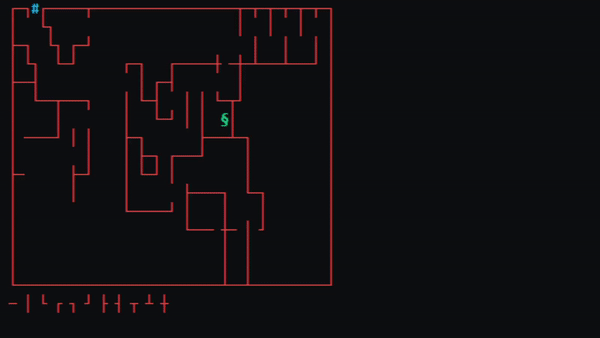
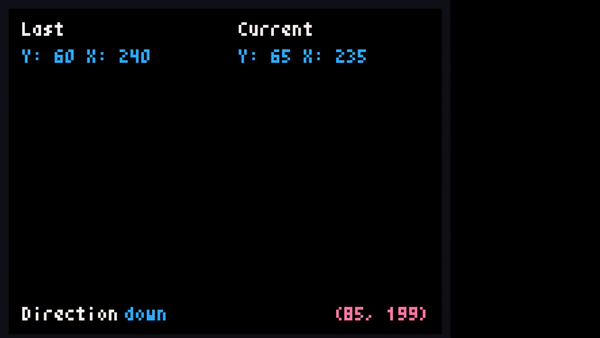

# Fake-Artificial-Intelligence
Um módulo para ajudar a criar um monstrinho que tem "inteligência" e tenta encontrar a saída do mapa proposto!

# Exemplos
Utilizando o módulo só que no terminal!

Utilizando o módulo só que utilizando a biblioteca Pyxel!

