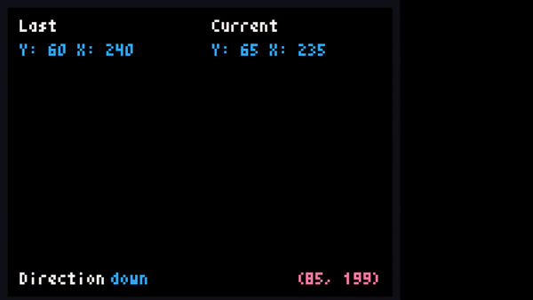

# Demonstração

# Pré definições
No canto superior esquerdo há a posição antiga do monstro, na direita, há a sua posição atual do monstro.
No canto inferior esquerdo, direção escolhida anteriormente, na direita, posição do mouse.

No canto inferior direito, quando precionado shift ou os botões do mouse, aparece a posição do mouse no grid e a ação atual, seja "*Shift*" para quando for apertado shift e "*Editor*" para quando ele estiver usando o mouse.

# Como usar
| Botão | Ação |
| ------------- | ------------- |
| SHIFT  | Coloca o monstro na posição do mouse  |
| DELETE  | Apaga todas as paredes |
| LEFT MOUSE | Coloca a parade na posição do mouse |
| RIGHT MOUSE | Apaga a parade na posição do mouse |

Segurando o botão esquerdo do mouse e movendo-o, é possível colocar várias paredes.
Com o botão direito também é possível, só que ao invés de colocar, ele apaga.

# Requerimentos
- Python 3.7+
- Pyxel (module)
- PyInstaller

# Agradecimentos
- [Cowboy](https://github.com/d4sein)
- [Gabe](https://github.com/ImGabe)
- [DEIVINNI](https://github.com/DEIVINNI)
- [Leovano - None](https://github.com/leovano)
- [jooj](https://github.com/EduardoMCF) (Liga dos Programadores)
